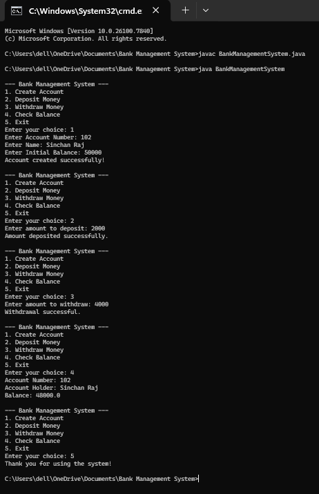

# 🏦 Bank Management System 

## 📌 Project Description
This is a console-based Bank Management System developed using Java.  
The program allows users to perform basic banking operations such as creating an account, depositing money, withdrawing money, and checking the account balance.

This project demonstrates basic Object-Oriented Programming (OOP) concepts in Java.

---

## ⚙️ Features
- Create bank account
- Deposit money
- Withdraw money
- Check account balance
- Menu driven program

---

## 🛠️ Technologies Used
- Java
- OOP Concepts
- Scanner Class

---

## ▶️ How to Run the Program

Compile the program

```
javac BankManagementSystem.java
```

Run the program

```
java BankManagementSystem
```

---

## 📷 Output



---

## 📁 Project Structure

```
Bank-Management-System-Java
│
├── BankManagementSystem.java
├── output.png
└── README.md
```

---

## 👨‍💻 Author
Sinchan P  
B.E. Computer Science Engineering  
Channabasaveshwara Institute of Technology